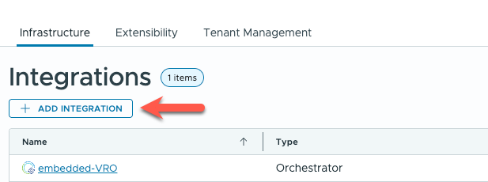
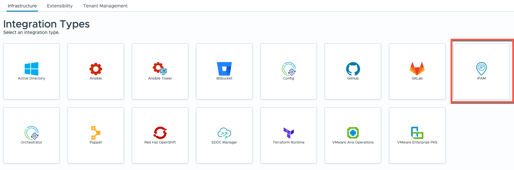
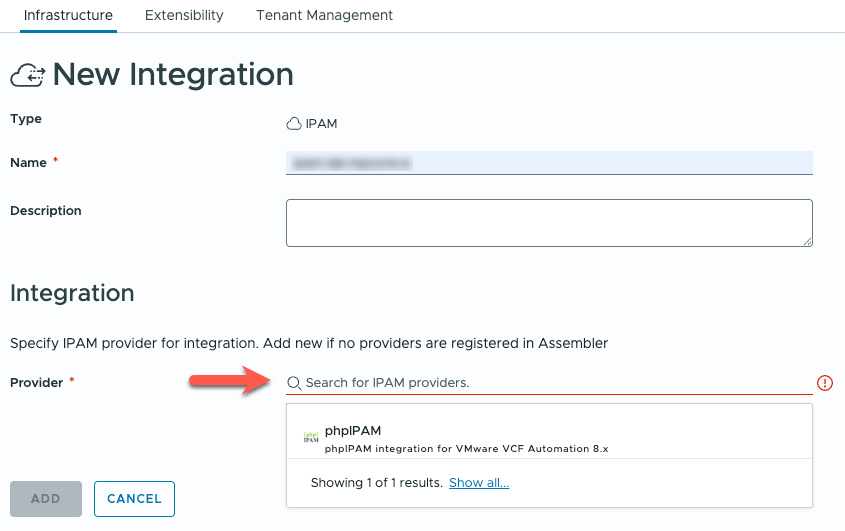
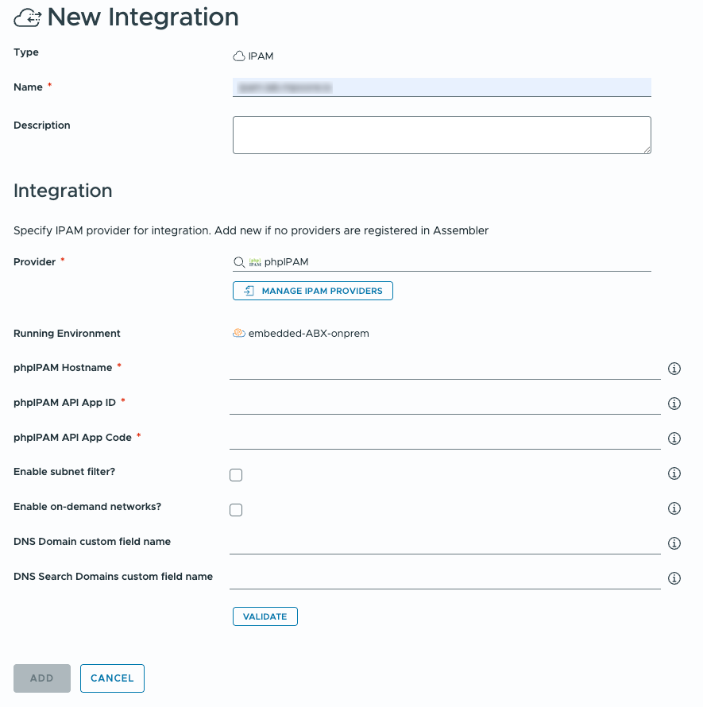
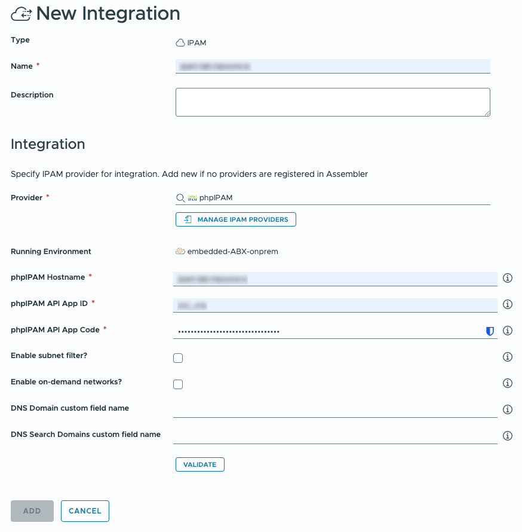
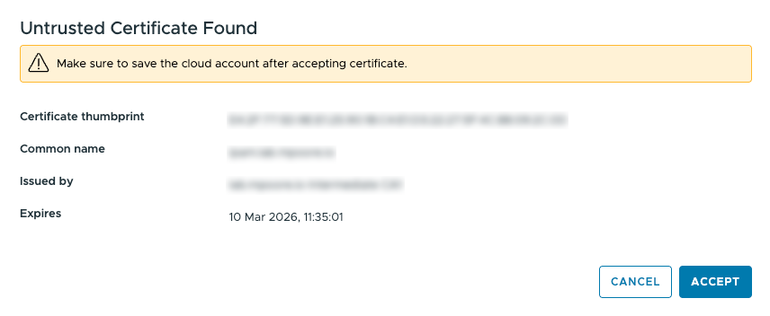
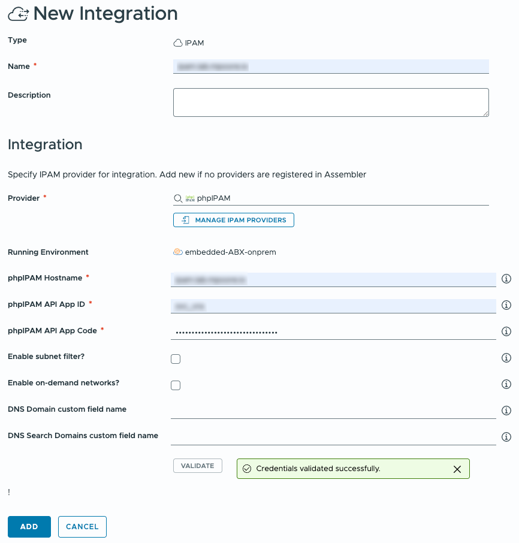
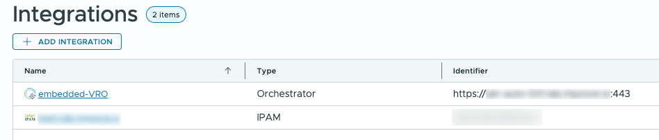

# Basic Configuration

A basic, minimal configuration of the phpIPAM integration with VMware VCF Automation is completed as follows and assumes that the provider has already been imported:

1. Login to VCF Automation as a user with administrative privileges to the Assembler component.

2. Navigate to **Infrastructure** > **Integrations**.

3. Click the button to **ADD INTEGRATION**.

4. From the list of possible integrations, pick **IPAM**.

5. Enter a unique name for the *New Integration*. Optionally, a description can be entered.

Select the **phpIPAM** integration from the list of available providers.

6. The available fields for the integration are displayed along with their default values. The required fields are marked with a red asterisk. They are:

- phpIPAM Hostname
- phpIPAM API App ID
- phpIPAM API App Code

7. Enter the FQDN of the phpIPAM instance, the App ID, and App Code into the relevant fields.

8. Click the **VALIDATE** button to check the connection from VCF Automation to the phpIPAM instance.

The SSL certificate used by phpIPAM may not be trusted. If that is the case, a prompt will be displayed asking for the discovered certificate to be accepted. Click the **ACCEPT** button.

9. If the connection is successful, a green message box is displayed and the **ADD** button will be enabled. Click **ADD** to complete the configuration.

10. The IPAM integration has now been configured and data collection will occur automatically.

