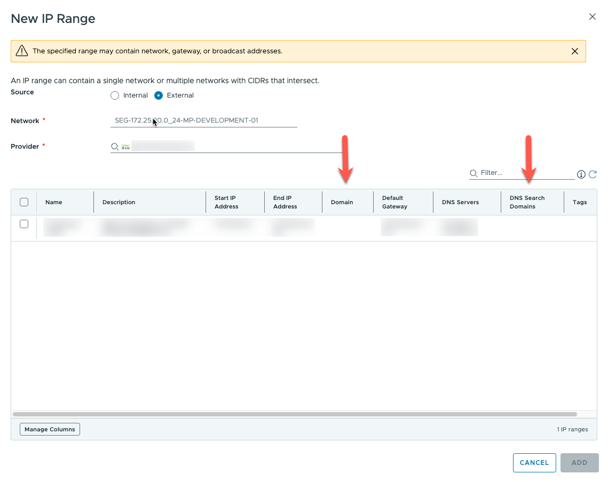
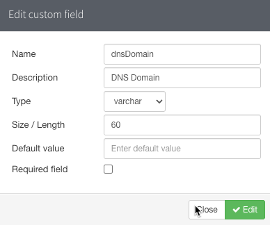
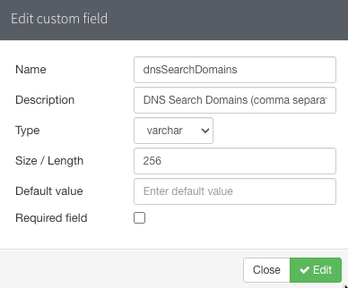
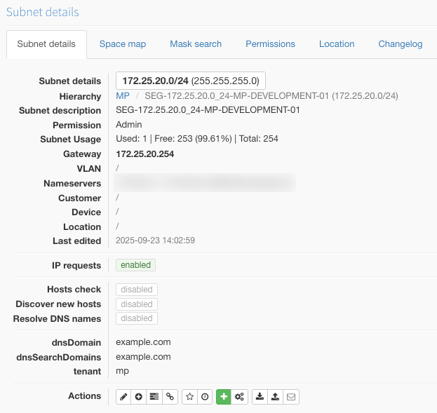
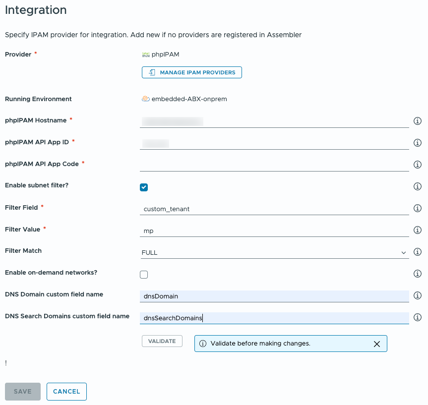

# DNS Configuration

When configuring *Network Profiles* in VMware VCF Automation, an external IPAM provider can be used to manage static IP addresses for provisioned virtual machines. That, of course, is the whole point of this integration.

However, there are other configurations that go into making up a virtual machine's network identity. These can also be specified in VCF Automation's *Network Profiles*. Items such as DNS domain, DNS servers and DNS search domains can be provided to provisioned virtual machines using *Network Profiles*.

In the example below, it can be seen that these configurations can be collected from an IPAM provider. In phpIPAM's case, only one of them (DNS servers) is natively supported. The DNS domain and DNS search domains are not populated.

## Custom Fields

To obtain DNS domain and DNS search domains values from phpIPAM, custom fields must be employed. This integration offers the capability to pull those pieces of information from phpIPAM by specifying a pair of custom fields.

Below are two examples of custom fields (which can be named anything) that are used for this purpose.

With those fields defined, values for them can be specified for each subnet in phpIPAM. An example of such a configuration is provided below:

## Integration Configuration

Once the custom fields are defined within phpIPAM, this integration's configuration must be updated accordingly.

Because both fields have to be custom fields, `custom_` is automatically prepended so only the name of the custom fields are required. In the example below the two custom fields are added.

The net result will be that that if values are populated for any subnet then they will be collected by VCF Automation.

## Saving Changes

To save any changes made to the integration's configuration, the API App Code must be re-entered and the connection validated before the changes can be saved.