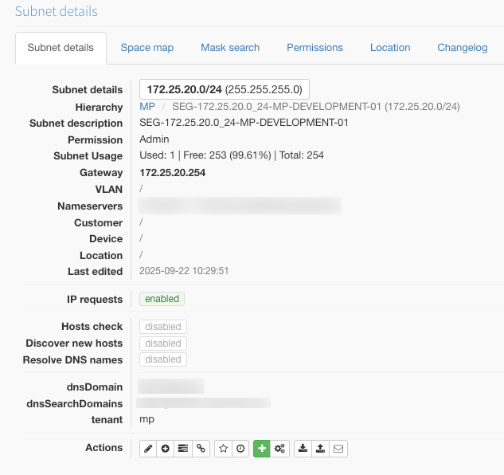
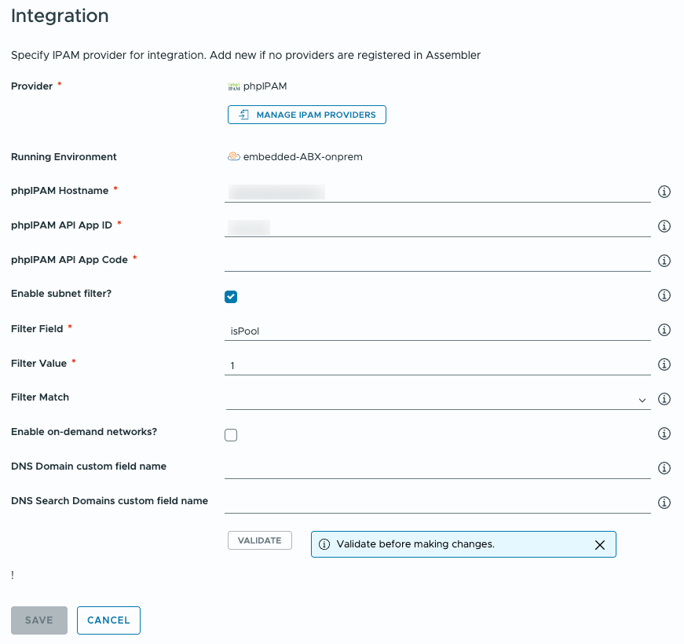
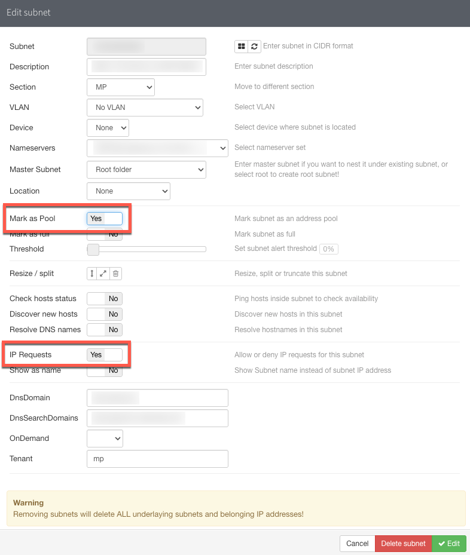
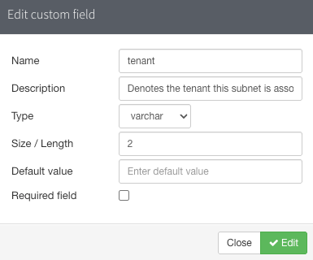

# Filter Configuration

Basic configuration of the phpIPAM integration establishes a connection from VMware VCF Automation to phpIPAM and allows VCF Automation to collect information about subnets configured in phpIPAM.

These subnets can be associated with infrastructure networks in *Network Profiles* within VCF Automation and allow it to allocate IP addresses from phpIPAM to provisioned virtual machines. These addresses are released in phpIPAM when the virtual machines are deprovisioned.

By default, the integration will collect data about all defined subnets in phpIPAM that have the IP requests option enabled. The example subnet below has this option turned on and will be available for use to allocate IP addresses from.

Note: Filter configuration affects both subnets collected for virtual machine provisioning *and* subnets collected for on-demand networks.

If there are a large number of subnets managed by phpIPAM, or there are a limited number of subnets that should be exposed to VCF Automation, then a filter can be set to restrict which subnets are discovered.

## Configuring the Filter

To enable the subnet filtering functionality, the integration's configuration must be changed. This can either be accomplished during it's initial configuration or at a later point. If editing the configuration however, the API App Code will be required to validate the connection and save the configuration changes.

Enabling the filter requires checking the checkbox marked **Enable subnet filter?**.

This then exposes two mandtory fields and one optional field. A default filter configuration is set but can be changed. The effect of the filter is to limit the scope of subnets that are discovered for use by VCF Automation. In the example above, the effect would be to limit discovery to subnets that meet the following two conditions:

1. "IP Requests" is enabled. (This is the default option that the integration always uses and can't be configured.)
2. "Mark as Pool" is enabled.

The example subnet below in phpIPAM would meet those criteria.

## Selecting a Filter Field

The default filter field, `isPool`, is a built-in field in phpIPAM. The full list of fields available for subnets can be found in phpIPAM's API documentation.

Another option is to use a custom field. Custom fields are defined in phpIPAM against particular types of objects, for example subnets, to extend the data held about each instance of an object.

An example of a custom field might be `tenant`, which is configured in phpIPAM below:

To filter using this field, its name must be prepended by `custom_` when adding it to the integration's configuration. Filtering can therefore be conducted against any field, built-in or custom, for a subnet.

## Filter Matching

Filter matching is optional, but allows more sophisticated filters to be created. As well as not being set, there are three filter matching options:

| Option       | Behaviour                                        |
| ------------ | ------------------------------------------------ |
| none / blank | (Default) The same as FULL, below.               |
| FULL         | Looks for an exact value match.                  |
| PARTIAL      | Matches substrings or partial values.            |
| REGEX        | Treats the filter value as a regular expression. |

Exhaustive testing of the filter functionality has not be conducted and depends on the capabilities exposed by phpIPAM.

## Saving Changes

To save any changes made to the integration's configuration, the API App Code must be re-entered and the connection validated before the changes can be saved.