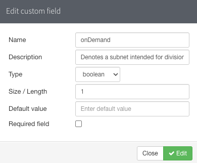
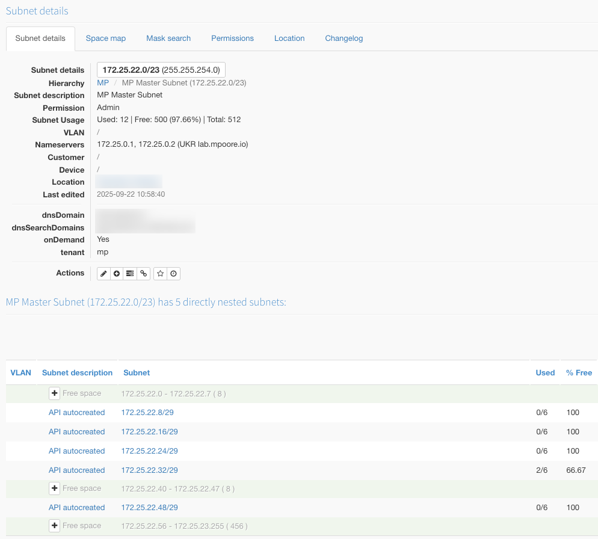
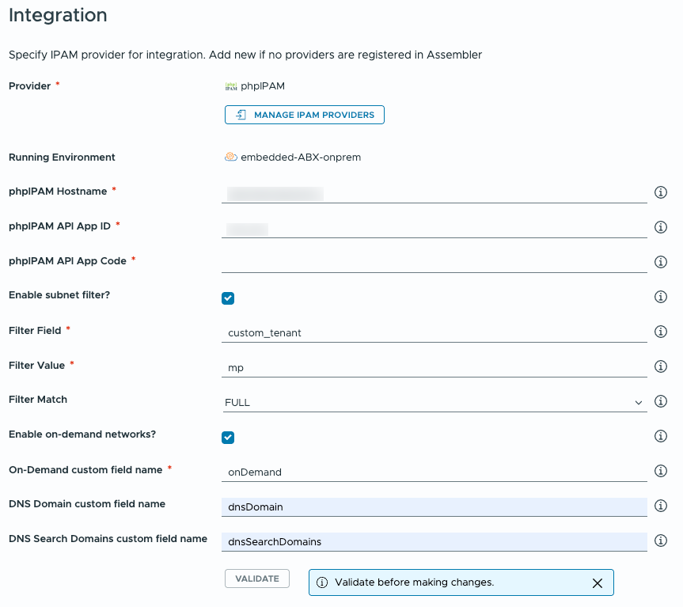

# On-Demand Networks

On-demand networks in VMware VCF Automation are networks that can be provisioned automatically alongside virtual machines to provide isolated or routed networks dedicated to a particular deployment. Basically it's Software Defined Networking (SDN).

To enable this functionality in conjunction with phpIPAM, a pool / block / range of addresses is required that can be carved up into smaller subnets. Configuration of the functionality in VCF Automation requires that range to be defined and this integrations job is to translate allocation requests from VCF Automation into correpsonding configuration changes in phpIPAM.

## Custom Fields

Marking subnets for use with on-demand networks using this integration requires creating another custom field. This time the field is a boolean (yes / no) field. Any subnets that havbe this field checked (i.e. yes) will show up when configuring on-demand networks in VCF Automation's *Network Profiles*.

This integration suggests a default name for the field of `onDemand` but the name can be whatever is clearest for the administrator. An example of the custom field configuration in phpIPAM is provided below.

## On-Demand Network Configuration in phpIPAM

With the custom field created, a true / yes value needs setting for any network blocks that should be used for on-demand networks.

In the example above, the `onDemand` field is ticked / checked. Any on-demand networks created will show up in phpIPAM as nested subnets. There are several shown in the example above.

If the subnet has settings applied for any of the following then any nested subnets will inherit those values:
- DNS servers
- DNS domain
- DNS search domains

## Enabling On-Demand Network Functionality

Enabling the on-demand functionality requires checking the checkbox marked **Enable on-demand networks?**.

This then exposes a mandtory field. A default custom field name is set, `onDemand` but this can be changed. The name of the field configured above should be used here.

Once the changes are saved, collection of on-demand networks will occur and allocation can be configured in VCF Automation's *Network Profiles*. Configuring on-demand networks is beyond the scope of this documentation. Please refer to VMware by Broadcom's documentation pages.

**Important:** Any subnet filter configuration is also applied when searching for subnets for on-demands networks.

## Saving Changes

To save any changes made to the integration's configuration, the API App Code must be re-entered and the connection validated before the changes can be saved.