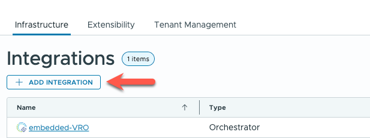
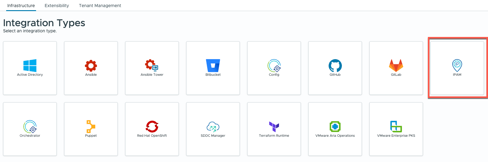

# Installation

## Download

The latest version of this integration can be downloaded from the [Releases](https://github.com/mpoore/phpipam-vcf-automation/releases) page. Only the phpIPAM-x.x.x.zip file needs to be downloaded, unless you want a copy of the source code!

## Installing the Integration

The integration zipfile downloaded above does *not* need to be unzipped. It is uploaded directly into VCF Automation as follows:

1. Login to VCF Automation as a user with administrative privileges to the Assembler component.

2. Navigate to **Infrastructure** > **Integrations**.

3. Click the button to **ADD INTEGRATION**.

4. From the list of possible integrations, pick **IPAM**.

5. On the *New Integration* page, click the **MANAGE IPAM PROVIDERS** button.

6. In the window for managing IPAM providers, click the **IMPORT PROVIDER PACKAGE** button.

(Note: the title of the window looks like it's subject to a bug in 8.18.1)

7. Select the *phpIPAM-x.x.x.zip* file that was downloaded.

8. Once the package is uploaded and extracted, a success message will be displayed. The window can now be closed using the **CLOSE** button.

That's all that is required to install the IPAM provider package into VCF Automation. The creation of a *New Integration* can be canceled if desired, for example if configuration of phpIPAM isn't complete yet.

# Upgrade

To upgrade the integration, the process is almost identical to the original installation:

1. Navigate to the IPAM providers management window via any existing of new integration.

2. Upload the updated package in the same way that the original was installed (see above).

3. When uploading another version of the same provider, a prompt will be displayed asking if the existing version (e.g. 0.1.0) should be replaced with a newer version (e.g. 0.1.1). Proceeding will overwrite the existing provider version for all configured integrations of that type. 