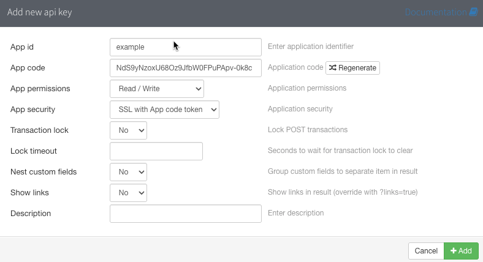

# Prerequisites

There are relatively few prerequisites to using this integration.

## VMware VCF Automation

The integration should work with any recent 8.x version of VCF Automation. It was developed against 8.18.1.

Network connectivity between the VCF Automation appliances and phpIPAM is assumed. By default this is TCP/443, unless phpIPAM is running on a different port.

## phpIPAM

URL rewriting is required on the webserver hosting phpIPAM in order for API access to function correctly. A guide for achieving this can be found via an internet search, but at the time of writing is located [here](https://phpipam.net/documents/prettified-links-with-mod_rewrite/)].

### phpIPAM Server Settings

"Prettify links" must be enabled. This changes links from e.g. `?page=administration&link2=settings` to `/administration/settings/`.

"API" must be enabled under *Feature Settings*.

### phpIPAM API Management

An API key is used by this integration to authenticate to phpIPAM. Before configuring the integration, an API key must be created. An example is shown below.

The key configurations are:
- The "App id" is effectively the user that this integration uses.
- The "App code" is effectively the password that this integration uses.
- The "App permissions" must be set to "Read / Write" in order for IP address allocations to be made.
- "Nest custom fields" should be set to "No" for this integration to function correctly.