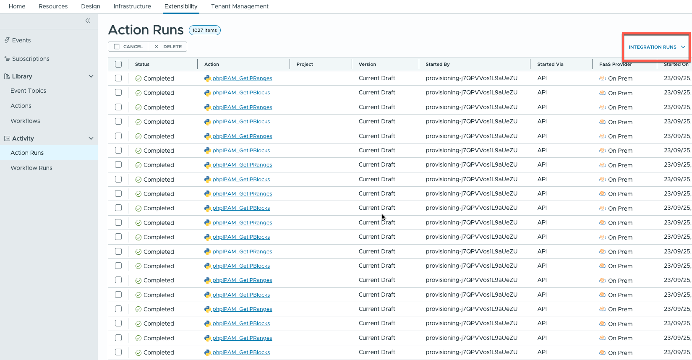

# Troubleshooting

In the event that errors are encountered, this page aims to provide a starting point for troubleshooting activities.

## Extensibility Action Runs

In VMware VCF Automation Assembler, an Extensibility menu exists that will allow executions of this integration's functions to be inspected.

Navigate to Extensibility > Action Runs. From the dropdown highlted in the image below, select INTEGRATION RUNS.

Recent executions for each of the functions will be listed. They are:

| Action Name                 | Purpose |
| --------------------------- | ------- |
| `phpIPAM_ValidateEndpoint`  | Executes whenever the "Validate" button is pressed on the integration's configuration page. This process performs a test connection to phpIPAM to validate the credentials supplied. |
| `phpIPAM_GetIPBlocks`       | Executes approximately every 10 minutes to retrieve subnets and their configuration from phpIPAM for use with on-demand networks. This function will not communicate with phpIPAM if the on-demand networks checkbox is not checked in the integration's configuration, but it will still execute. |
| `phpIPAM_GetIPRanges`       | Executes approximately every 10 minutes to retrieve subnets and their configuration from phpIPAM for virtual machine IP allocations. This function will not execute if `phpIPAM_GetIPBlocks` fails. |
| `phpIPAM_AllocateIP`        | Executes when a virtual machine IP allocation request is made. |
| `phpIPAM_DeallocateIP`      | Executes when a virtual machine IP deallocation request is made. |
| `phpIPAM_Update`            | Executes when virtual machine provisioning is complete to update the owner of the deployment and the MAC address of the virtual machine in phpIPAM. |
| `phpIPAM_AllocateIPRange`   | Executes when an on-demand network allocation request is made. |
| `phpIPAM_DeallocateIPRange` | Executes when an on-demand network deallocation request is made. |

Clicking on an individual action will enable variables and logs for the run to be examined. If raising an issue for this integration, action run logs may be useful.

## phpIPAM API Exploration

Using a tool such as Postman or Bruno, in conjunction with phpIPAM's API documentation, the API calls used by this integration can be used to reproduce the functionality provided and may yield clues that point to a misconfiguration or an error.